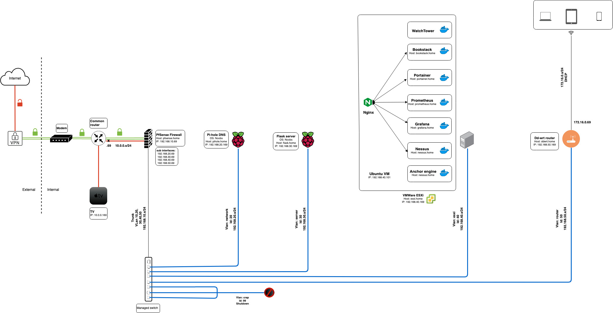

# Home lab Network diagram
This repo shows Network diagram and lists Operating systems and Services that are used to build out my Home Lab. The idea behind building out a home lab is to ensure, the lab is network segmented, use a Firewall, set up scans to identify vulnerabilities etc. This repo also keep tracks of the changes/upgrades that are made to the lab over the period of time.

### Network Diagram

*[Draw.io](https://app.diagrams.net/) is used to draw Network diagram.*

### Services
- [Pi-hole](https://pi-hole.net/) used for DNS.
- [Flask server](https://flask.palletsprojects.com/) used for Website.
- [Nginx](https://www.nginx.com/) used for Reverse Proxy.
- [Docker](https://www.docker.com/) used for Container platform.
- [Bookstack](https://www.bookstackapp.com/) used for organising and storing information.
- [Whoogle](https://github.com/benbusby/whoogle-search) used as Google alternative.
- [Nessus](https://www.tenable.com/products/nessus) used to scan hosts on the network.

### Operating systems
- [PfSense Firewall](https://www.pfsense.org/)
- [Cisco IOS](https://www.cisco.com/c/en/us/products/ios-nx-os-software/index.html)
- [Noobs Lite](https://www.raspberrypi.org/downloads/noobs/)
- [Ubuntu server](https://ubuntu.com/download/server)
- [VMWare ESXi](https://www.vmware.com/products/esxi-and-esx.html)
- [DD-WRT](http://www.dd-wrt.com/)
